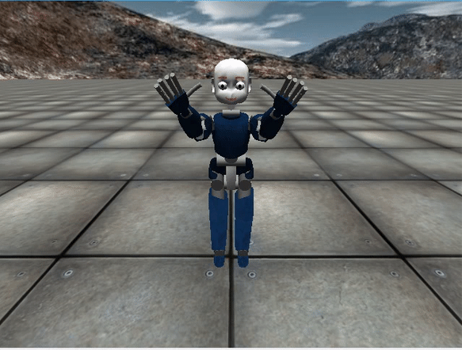
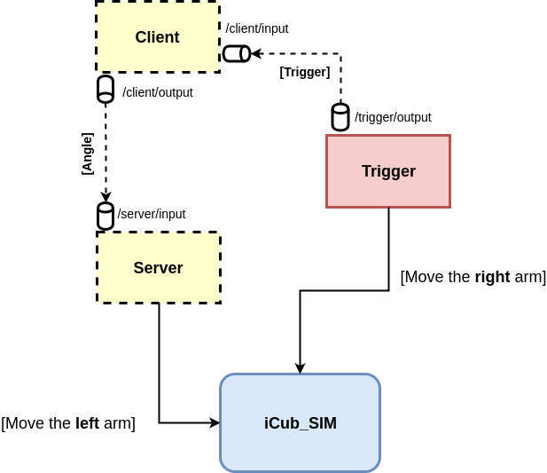

Motor control with YARP
=======================
# Prerequisites :closed_book:
For this assignment, you just need to be aware of:
- [YARP ports](http://www.yarp.it/note_ports.html)
    - [yarp::os::Bottle](http://www.yarp.it/classyarp_1_1os_1_1Bottle.html)
    - [yarp::os::Port](http://www.yarp.it/classyarp_1_1os_1_1Port.html)
    - [yarp::os::BufferedPort](http://www.yarp.it/classyarp_1_1os_1_1BufferedPort.html)
- [YARP devices](http://www.yarp.it/yarpdev.html)
    - some Yarp Motor Interfaces:
        - [yarp::dev::IEncoders](http://www.yarp.it/classyarp_1_1dev_1_1IEncoders.html)
        - [yarp::dev::IPositionControl2](http://www.yarp.it/classyarp_1_1dev_1_1IPositionControl2.html)
        - [yarp::dev::IControlMode2](http://www.yarp.it/classyarp_1_1dev_1_1IControlMode2.html)
# Assignment
Let's make iCub wave :wave: !

### Scenario
During this assignment, you will be provided with the system described in the following diagram:

In this system, the **Trigger** moves the **joint 2** of *iCub_SIM* `right_arm` periodically, between **X** and **-X**, and sends to the **Client** a signal for waking it up. 

Then, once the **Client** wakes up, it sends to the **Server** the angle **X** every period **T**.

The **Server** makes use of that angle as setpoint to move the **joint 2** of iCub_SIM `left_arm`.  

### TODO :wrench: :nut_and_bolt:
You have to modify the code provided in order to let the **Server** move the `left_arm` with the same amplitude and period of the movement of the `right_arm`, which is in turn controlled by the **Trigger** module.

The **Trigger** is already provided in its final shape :ok_hand: **Don't touch it !** :knife:

In particular, to complete this assignment you have to:
- Modify [`client.cpp`](./src/client.cpp) implementing the comunication part for receiving the trigger and sending the angle to the **Server**.
- Modify [`server.cpp`](./src/server.cpp) implementing the comunication part for receiving the angle by the **Client** and move the left arm.
- Find the correct values of **X** and **T**.

By the way, just follow the `FILL IN THE CODE` comments inside the code and it will be **easy-peasy** :smirk:

:warning: **You have not to be worried about the connections between ports, they have NOT to be established inside the modules**

Once done, you can test your code running the script [**test.sh**](https://github.com/vvv-school/vvv-school.github.io/blob/master/instructions/how-to-run-smoke-tests.md) in the **smoke-test** directory. This will give you an idea of how many points you might score. :muscle:

### Grading :chart_with_upwards_trend:

The **smoke-test** evaluates the *similarity* between the movements of the right and left arm of iCub.

In particular, it records _n_ values from the encoders of both arms storing them in the **A** and **B** vectors referenced below, respectively, to then calculate the similarity by means of the following formula:

The **cosine similarity** is equal to **-1** if the movement of the arms are in counter-phase, equal to **1** if the movements are in phase.
This measures how much the period **T** you chose is close to the one of the **Trigger** module.
Moreover, the test checks that the ratio of the norms of **A** and **B** is ~ 1; it allows verifying if the value **X** you set is correct.

Here's the score map:

| Requirements             | Points |
|:------------------------:|:-:|
| Cosine similarity > -1.0 | 1 |
| Cosine similarity > -0.5 | 1 |
| Cosine similarity >  0.0 | 2 |
| Cosine similarity >  0.5 | 4 |
| Norm ratio == 1          | 4 |
| **Maximum score**        | 12 :trophy: |

# [How to complete the assignment](https://github.com/vvv-school/vvv-school.github.io/blob/master/instructions/how-to-complete-assignments.md)
